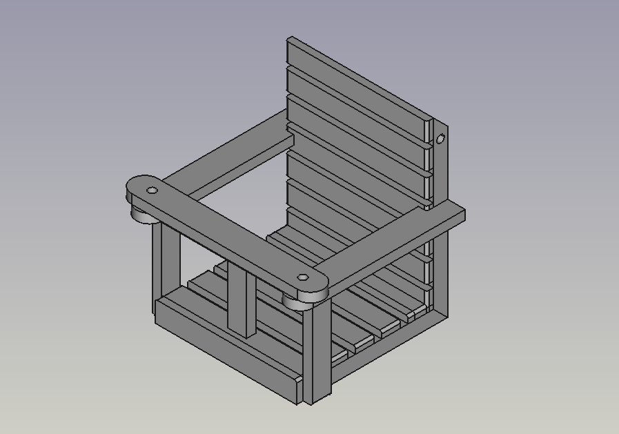
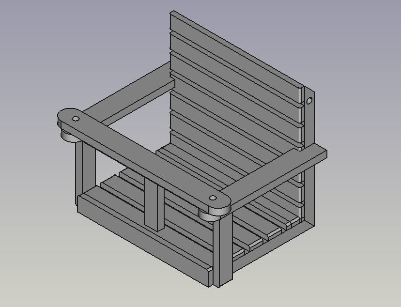
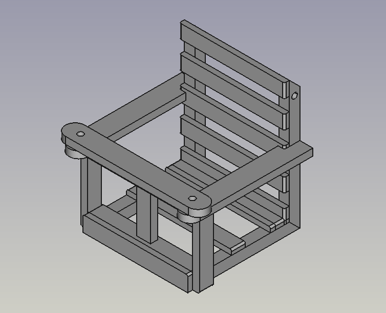

# About

Plans for a wooden child's swing.

Everything is made under freecad 0.21 and is parametric, so that the dimensions can easely be adjusted.
Plans are in french, because... [I'm French](https://www.youtube.com/watch?v=pfUmW_Mf5qc)!

